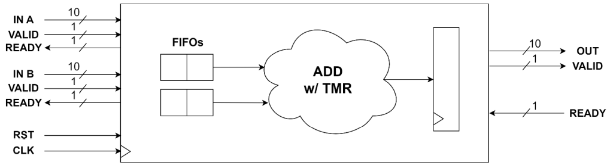

# CGRA_SignedC2_Sum_FU_TMR
## Short Description:
Designing a Functional Unit (FU) of a Coarse-Grained Reconfigurable Array (CGRA) architecture for signed C2 sums with 8-bit input and output data, 2-bit flag(carry, overflow, etc.), ready-valid communication protocol along the entire data chain and fault detection and correction (TMR) mechanisms on the combinatorial part of the architecture

## Full Description:
Objective: to design the Functional Unit (FU) of a Coarse-Grained Reconfigurable Array (CGRA) architecture for performing signed sums in C2. The architecture shall have the following characteristics:
1. Inputs and outputs consisting of 8-bit data and 2-bit flag (carry, overflow, etc.)
2. Ready-valid communication protocol along the entire data chain
3. Application of fault detection and correction (TMR) mechanisms on the combinatorial part of the architecture

Below is the block diagram:

The final project report shall contain:
- Introduction (algorithm description, possible applications, possible architectures, etc.)
- Description of the architecture selected for implementation (block diagram, inputs/outputs, etc.)
- VHDL code (with detailed comments)
- Test plan and related Testbench for verification
- Results of automatic logic synthesis on Xilinx FPGA Zync platform: resources used (slice, LUT, etc.), maximum operating frequency, critical path, etc. with comments on any warning messages
- Conclusions